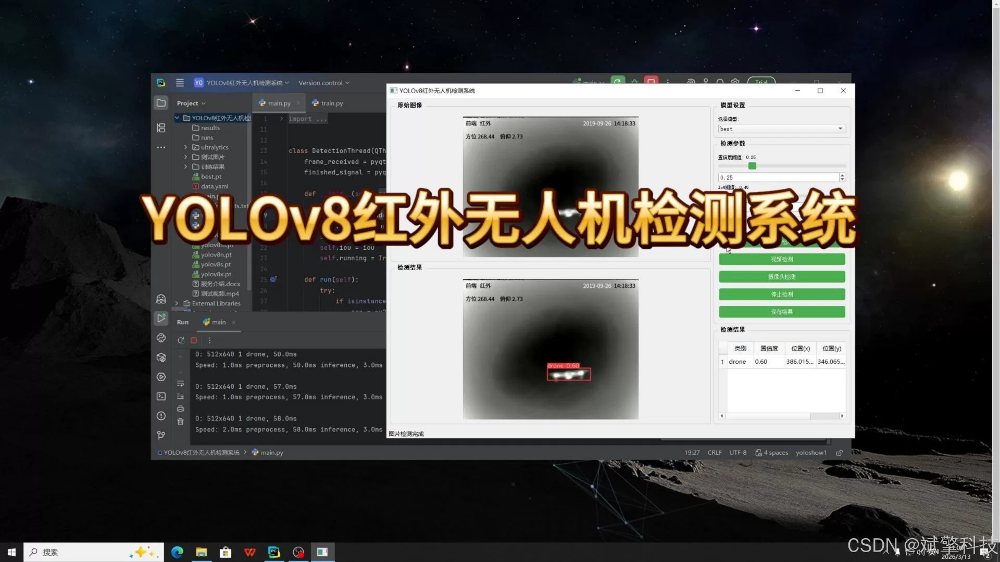
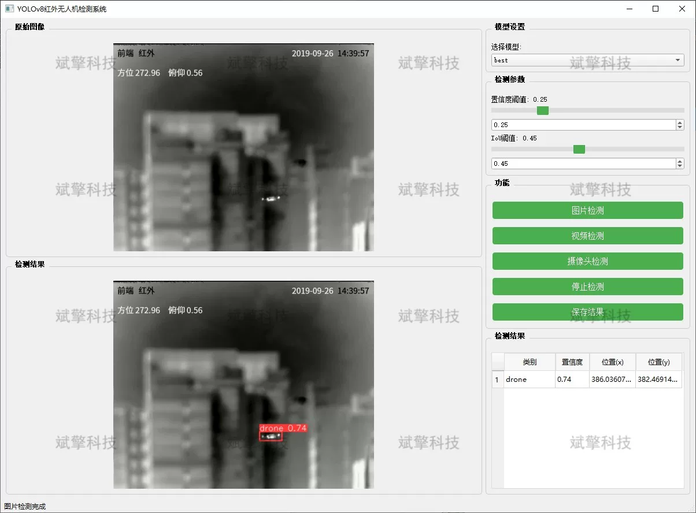
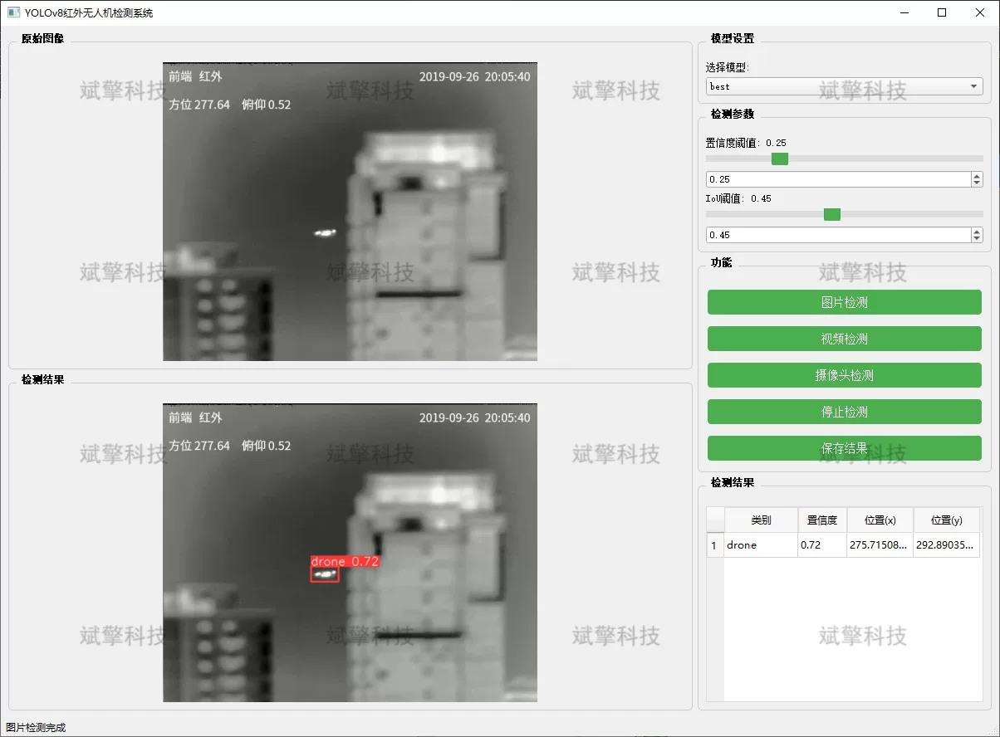
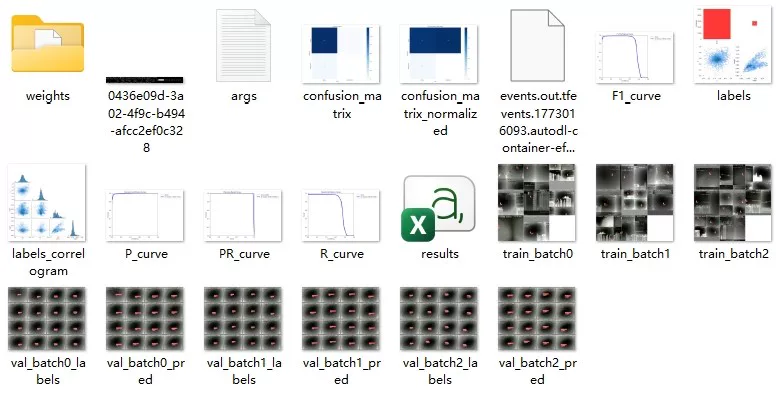
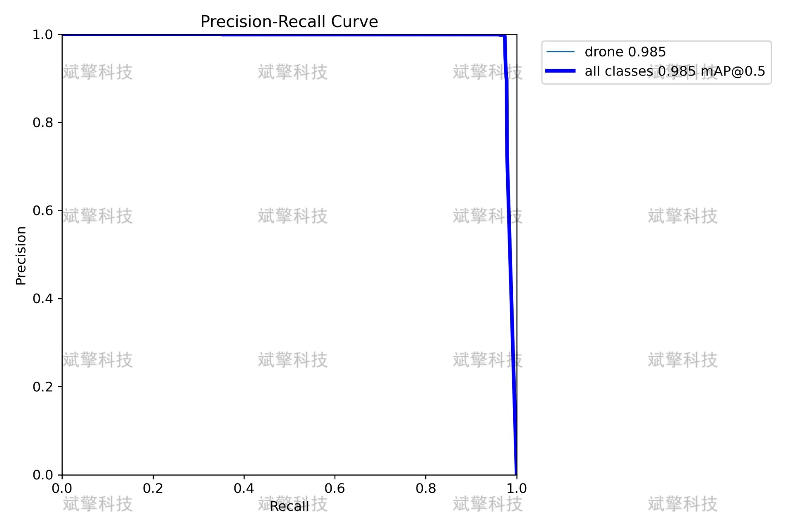

# YOLOv8 Infrared Drone Detection System

## Body

YOLOv8 Infrared Drone Detection System, based on the YOLOv8 deep learning algorithm, has developed a drone detection system specifically for infrared scenes. Addressing the issue of poor performance in complex environments such as nighttime and smoke with traditional visible light detection, the system utilizes the unique temperature perception characteristic of infrared thermal imaging technology combined with the powerful feature extraction and real-time detection capabilities of YOLOv8 to achieve high-precision recognition of low-altitude drone targets. The system provides a complete graphical user interface that supports image, video, and real-time camera detection modes, and can be widely applied in low-altitude security, no-fly zone protection, military reconnaissance, and night patrol scenarios.

System Features:
✅ Image Detection: Can detect images and return detection boxes and category information.
✅ Video Detection: Supports video file input to detect each frame in the video.
✅ Real-Time Camera Detection: Connects USB cameras to achieve real-time monitoring.
✅ Real-time parameter adjustment (confidence and IoU thresholds)
Dataset Overview:
Validation set (Val): Total 1233 images.
Training set (Train): Total 5019 images

## Images

## Payment

Here is a pay link on Stripe ( https://buy.stripe.com/3cs8yP7sY87d0vu9AB ). Please contact me lonlonago@foxmail.com after funding $89, and I will send you a complete data files , thank you!

